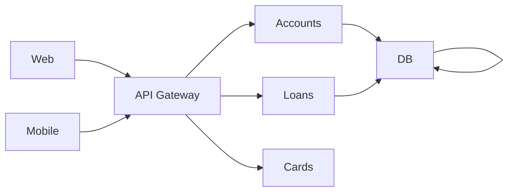

1. Domain Driven Sizing: Specific domain.Sets the logical borders.High Cohesion
2. Event Storming Sizing:Sets the functional borders.Loose Coupling
3. Strangler Fig Pattern
4. VM vs Container vs Software Container vs Docker vs Kubernetes
5. Generating docker images:
    1. Dockerfile 
    2. Buildpacks: Run command "`mvn spring-boot:build-image`"
    ```xml
            <plugin>
				<groupId>org.springframework.boot</groupId>
				<artifactId>spring-boot-maven-plugin</artifactId>
				<configuration>
					<image>
						<name>loans:m3</name>
					</image>
				</configuration>
			</plugin>
    ```
    3. google jib

6. Layman defination
7. Hyrums's defination
8. CNCF: Cloud Native Computing Foundation
	1. Microservices
	2. Containers
	3. Scalability
	4. Elasticity
	5. DevOps Practices
	6. Resilience & Fault Tolerance
	7. Cloud native services
9. Heroku cloud platform introduced 12 factor methodolgy.
10. Service discovery agent
  1. Netflix Eureka:


		`application.properties for client side`


		```yml
			eureka.client.service-url.defaultZone=http://localhost:8761/eureka/
			eureka.instance.prefer-ip-address=true
			eureka.instance.hostname=localhost
		```


		`application.properties for server side`


		```yml
		eureka.client.register-with-eureka=false
		eureka.client.fetch-registry=false
		eureka.client.service-url.defaultZone=http://localhost:8761/eureka/
		```


		`ram size allocation`


		```bash
		mvn spring-boot:run -Dspring-boot.run.jvmArguments="-Xmx2g -Xms512m"
		```


  2. Consul
  3. Apache Zookeeper
11. Load balancing
  1. Netflix Ribbon client side
  2. Spring Cloud Load Balancer

12. Fault Tolerance
	1. Resilience4j 

13. Gateway: Reactive gateway
	`For avoiding any kind of issue use spring 4.0.4 and reactive gateway`
	```yml
		management.endpoints.web.exposure.include=*
		management.endpoint.gateway.access=unrestricted
		spring.cloud.discovery.enabled=true
		spring.cloud.gateway.server.webflux.discovery.locator.enabled=true
		spring.cloud.gateway.server.webflux.discovery.locator.lower-case-service-id=true
		spring.main.web-application-type=reactive
	```
	`URL:http://localhost:${port no}/actuator/gateway/routes`

	`Code for custom configuration:`
	```java
		@Configuration
		public class CustomRouteLocator {
			@Bean
			RouteLocator routeLocator(RouteLocatorBuilder builder) {
				return builder.routes()
						.route(p -> p.path("/hello/ac/**")
								.filters(f -> f.rewritePath("/hello/accounts/(?<segment>.*)", "/${segment}"))
								.uri("lb://ACCOUNTS"))
						.route(p -> p.path("/hello/loans/**")
								.filters(f -> f.rewritePath("/hello/loans/(?<segment>.*)", "/${segment}"))
								.uri("lb://LOANS"))
						.build();
			}
		}
	```

14. Design pattern around API gateway

